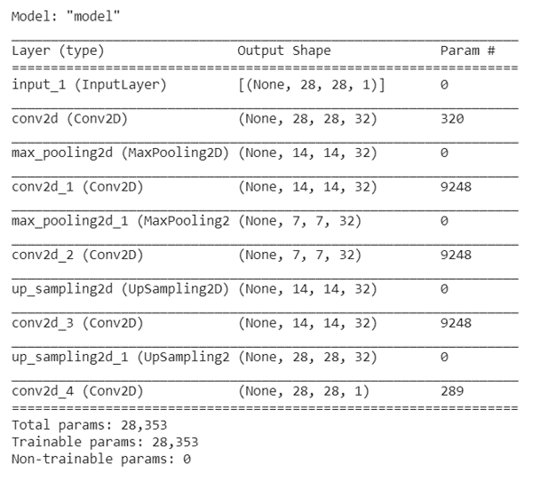

# DAE (Denoising Autoencoder)

> The study objective: DL for reconstructing clearer images. 

## Table of contents
* [General info](#general-info)
* [Autoencoder](#Link)
* [Packages and approaches](#R)
* [Status](#status)
* [Inspiration](#inspiration)
* [Files](#files) 

## General info
There is always a need to reconstruct a corrupted image where either part of image is lost or is stained.

## Autoencoders
The autoencoders in an unsupervised manner compresses the input into latent representation state and reconstructs the output (as close as possible to input) for the representation.

[Autoencoder](https://www.deeplearningbook.org/contents/autoencoders.html)

## Packages and approaches
keras, pandas, numpy,matplotlib

#### Code Example - network and loss
      x = layers.Conv2D(32, (3, 3), activation='relu', padding='same')(input_img)
      x = layers.MaxPooling2D((2, 2), padding='same')(x)
      x = layers.Conv2D(32, (3, 3), activation='relu', padding='same')(x)
      encoded = layers.MaxPooling2D((2, 2), padding='same')(x)

      # At this point the representation is (7, 7, 32)

      x = layers.Conv2D(32, (3, 3), activation='relu', padding='same')(encoded)
      x = layers.UpSampling2D((2, 2))(x)
      x = layers.Conv2D(32, (3, 3), activation='relu', padding='same')(x)
      x = layers.UpSampling2D((2, 2))(x)
      decoded = layers.Conv2D(1, (3, 3), activation='sigmoid', padding='same')(x)
      autoencoder = keras.Model(input_img, decoded)
      autoencoder.compile(optimizer='adam', loss='binary_crossentropy')
        
  
  
## Status
Project is completed.

## Inspiration
Application of AI based denoising for improved denoised images compared to traditional filtering.

## Files 
Ref codes: https://github.com/melaniaAB/DAE.git

